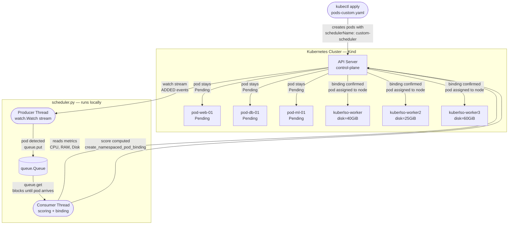

# KuberLSO — Custom Kubernetes Scheduler

Operating Systems Lab — UNISINOS 2026/01  
Student: Gabriel Hartmann

---

## What this project does

This project implements a **custom Kubernetes scheduler** that replaces the default scheduling algorithm with a weighted multi-metric approach.

The default Kubernetes scheduler considers only CPU and memory. This project adds **disk space** as a third metric:

| Metric | Weight | Source |
|---|---|---|
| Free CPU (millicores) | 40% | `node.allocatable` − pod requests |
| Free RAM (MiB) | 35% | `node.allocatable` − pod requests |
| Free Disk (GiB) | 25% | Node label `disk-free-gib` |

Each metric is **min-max normalised** across all candidate nodes and combined into a final score. The node with the highest score receives the pod.

---

## Architecture



---

## File structure

```
KuberLSO/
├── cluster/
│   └── kind-config.yaml        # 1 control-plane + 3 workers
├── k8s/
│   └── rbac.yaml               # permissions for the scheduler
├── scheduler/
│   ├── scheduler.py            # Producer/Consumer threads + binding
│   ├── metrics.py              # reads CPU, RAM and Disk from each worker
│   └── scoring.py              # min-max normalisation and weighted scoring
├── pods/
│   └── pods-custom.yaml        # 15 pods → custom-scheduler
├── monitor/
│   └── monitor.py              # real-time dashboard (optional)
├── requirements.txt
└── setup.sh
```

---

## How to run

### Prerequisites

Run in **PowerShell or CMD**:
```powershell
winget install Kubernetes.kind
winget install Kubernetes.kubectl
```

Also install:
- **Docker Desktop** (must be running before anything else)
- **Python 3.11+** with "Add to PATH" checked in the installer

> All remaining commands must be run in **Git Bash**.

---

### Step 1 — Install Python dependencies

```bash
cd /c/Users/<your-user>/KuberLSO
pip install -r requirements.txt
```

### Step 2 — Create the cluster

```bash
kind create cluster --name kuberlso --config cluster/kind-config.yaml
kubectl get nodes
```

Expected: 4 nodes with status `Ready`.

### Step 3 — Inject disk metric

```bash
kubectl label node kuberlso-worker  disk-free-gib=40
kubectl label node kuberlso-worker2 disk-free-gib=25
kubectl label node kuberlso-worker3 disk-free-gib=60
```

### Step 4 — Apply RBAC

```bash
kubectl apply -f k8s/rbac.yaml
```

### Step 5 — Start the scheduler (Terminal 1)

```bash
cd scheduler
python scheduler.py
```

Keep this terminal open. The scheduler waits for pods.

### Step 6 — Create the pods (Terminal 2)

```bash
kubectl apply -f pods/pods-custom.yaml
```

Watch Terminal 1: for each pod you will see the node scores and the final BIND.

### Step 7 — Verify placement

```bash
kubectl get pods -o wide
```

---

## How the algorithm works

For each pending pod:

1. **Filters** nodes without enough CPU or RAM
2. **Normalises** each metric: `(value − min) / (max − min)` → result between 0 and 1
3. **Weighs**: `score = 0.40×cpu + 0.35×ram + 0.25×disk`
4. **Selects** the highest-scoring node and binds the pod via `create_namespaced_pod_binding`

Example with 3 workers and a pod requesting 200m CPU / 128 MiB RAM:

| Worker | Free CPU | Free RAM | Free Disk | Score |
|---|---|---|---|---|
| worker-1 | 3800m | 7800 MiB | 40 GiB | 0.82 ← **chosen** |
| worker-2 | 1200m | 3200 MiB | 25 GiB | 0.31 |
| worker-3 | 2500m | 5000 MiB | 60 GiB | 0.60 |

---

## Producer/Consumer pattern

| Thread | Role |
|---|---|
| **Producer** | Opens a `watch.Watch()` stream against the Kubernetes API. Pods with `schedulerName: custom-scheduler` in `Pending` state are placed in the `queue.Queue` for scheduling. |
| **Consumer** | Blocks on `queue.get()`. When a pod arrives, calls `metrics.py` + `scoring.py` and performs the binding |

The queue is the only communication channel between threads — no manual locks needed because `queue.Queue` is thread-safe by design.

---

## Optional tools

### Real-time monitor

```bash
python monitor/monitor.py
```

Displays resources per worker (CPU, RAM, Disk), a utilisation bar, and a pod list with their assigned nodes. Refreshes every 3 s.

---

## Teardown

```bash
kind delete cluster --name kuberlso
```

---

## License

MIT
